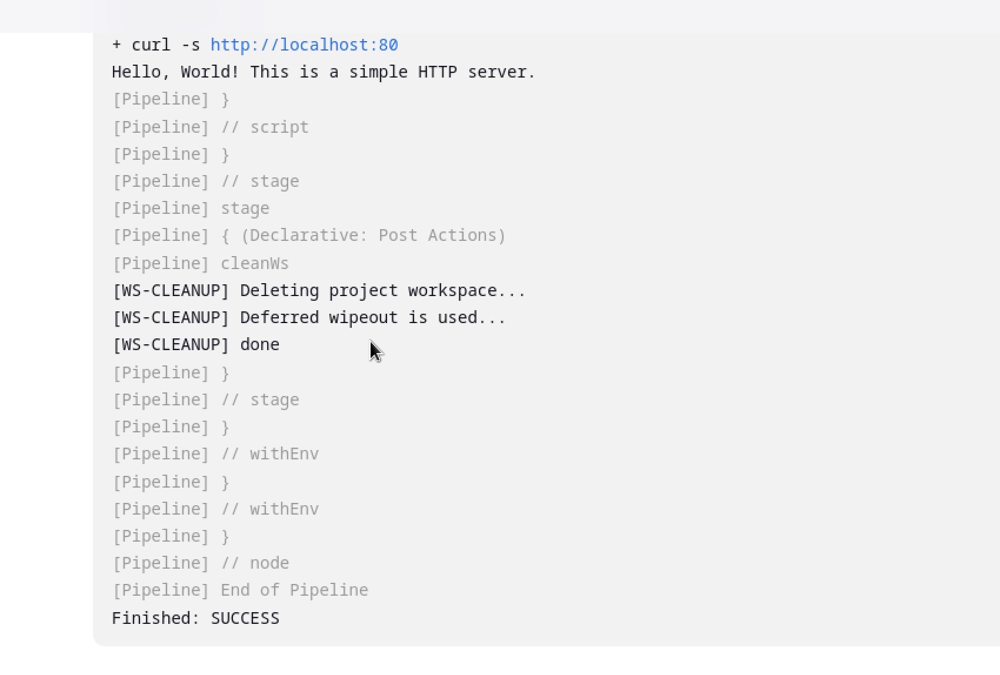

# CI/CD Pipeline for Python App with Docker and Jenkins

## Проект

Цей репозиторій містить простий Python-додаток, який запускає HTTP-сервер. Для автоматизації побудови, тестування та розгортання додатку налаштовано Jenkins пайплайн.

## Опис проекту

1. **app.py** — простий Python-сервер, який відповідає на HTTP-запити.
2. **Dockerfile** — контейнеризація Python-додатку.
3. **Jenkinsfile** — конфігурація CI/CD пайплайна для Jenkins, що включає етапи:
   - Збірка Docker-образу.
   - Розгортання Docker-контейнера.
   - Тестування за допомогою HTTP-запиту.
   - Зупинка контейнера та видалення образу.

## Налаштування

### 1. Створіть репозиторій на GitHub

- Створіть репозиторій на GitHub і завантажте код.
- Замініть `REPO_URL` у `Jenkinsfile` на URL вашого репозиторія.

### 2. Налаштування Docker

- Встановіть Docker на вашу машину або сервер.
- Для запуску контейнера використовується Dockerfile, який будує образ і запускає сервер.

### 3. Налаштування Jenkins

1. Встановіть Jenkins і налаштуйте плагіни для роботи з Docker.
2. Створіть новий проект у Jenkins:
   - Тип проекту: Pipeline.
   - Вкажіть URL репозиторія та вкажіть шлях до `Jenkinsfile`.
3. В Jenkins, натисніть кнопку "Build Now" для запуску пайплайну. Якщо все налаштовано правильно, Jenkins виконає етапи збірки образу, тестування та розгортання.

### 4.Перевірка

1.На сторінці пайплайну можна побачити, як кожен етап успішно виконується або отримує повідомлення про помилку.

2.Також можно побачити що сервер відповідає статусом 200.

Кінцевий Результат
Налаштований пайплайн: Пайплайн можна запустити в Jenkins для автоматичної збірки, тестування і розгортання.
Документований процес: Документація доступна для налаштування і використання Jenkins пайплайну для контейнеризованого Python-додатку.

# Документація по налаштуванню моніторингу з Prometheus, Grafana та Node Exporter

Цей проект налаштовує моніторинг за допомогою **Prometheus**, **Grafana** та **Node Exporter** для збору метрик з вашого сервера або контейнерів. Також налаштовані алерти для високого використання CPU та пам'яті.

## Крок 1: Налаштування мережі Docker

Створіть користувацьку мережу для контейнерів:

docker network create monitoring

## Крок 2: Налаштування Node Exporter

2.1 Запустіть контейнер Node Exporter:

docker run -d --name node_exporter \
  --network monitoring \
  -p 9100:9100 \
  prom/node-exporter

2.2 Додайте метрики Node Exporter в конфігурацію Prometheus:
У файлі prometheus.yml додайте новий блок для збору метрик з Node Exporter.

## Крок 3: Налаштування Prometheus
   
3.1 Створіть файл конфігурації Prometheus (prometheus.yml) і налаштуйте його для моніторингу ваших контейнерів

3.2 Запустіть контейнер Prometheus з монтуванням конфігурації:

docker run -d --name prometheus \
  --network monitoring \
  -p 9090:9090 \
  -v /path/to/prometheus.yml:/etc/prometheus/prometheus.yml \
  prom/prometheus
    
## Крок 4: Налаштування Grafana

4.1 Запустіть контейнер Grafana:

docker run -d --name grafana \
  --network monitoring \
  -p 3000:3000 \
  grafana/grafana

4.2 Відкрийте Grafana в браузері:
Перейдіть за адресою: http://localhost:3000. Увійдіть із стандартними обліковими даними:

Логін: admin
Пароль: admin
Додайте джерело даних Prometheus:
Перейдіть у Configuration -> Data Sources.
Виберіть Prometheus.
В полі URL вкажіть http://prometheus:9090, де prometheus — це ім'я контейнера Prometheus.
Натисніть Save & Test.
    
4.3 Створення дашборда
 
 Перейдіть до Create -> Dashboard.

 Додайте панель (наприклад, Graph) і виберіть як джерело даних Prometheus.Також можно використати вже готовий id - 1860

  

## Крок 5: Моніторинг контейнеру додатка за допомогою cadvisor

5.1 Запустіть контейнер cAdvisor, використовуючи наступну команду:

   docker run -d \
  --name=cadvisor \
  --network=monitoring \
  -p 8080:8080 \
  --volume=/:/rootfs:ro \
  --volume=/var/run:/var/run:ro \
  --volume=/sys:/sys:ro \
  --volume=/var/lib/docker/:/var/lib/docker:ro \
  google/cadvisor:latest

5.2 Для збору метрик з cAdvisor потрібно додати новий блок в конфігураційний файл Prometheus prometheus.yml:

    scrape_configs:
  - job_name: 'cadvisor'
    static_configs:
      - targets: ['cadvisor:8080']

5.3 Налаштування Grafana для візуалізації метрик 
    
   Додайте джерело даних Prometheus:
    
   Перейдіть у Configuration -> Data Sources.
    
   Виберіть Prometheus.
    
   В полі URL вкажіть http://prometheus:9090, де prometheus — це ім'я контейнера Prometheus.
    
   Натисніть Save & Test.
    
   Створення дашборда
 
   Перейдіть до Create -> Dashboard.

   Додайте панель (наприклад, Graph) і виберіть як джерело даних Prometheus.Також можно використати вже готовий id - 14282

   

## Крок 6: Налаштування алертів у Prometheus

   
   6.1 Оновіть файл prometheus.yml, додавши налаштування для алертів:

        rule_files:
      - "alert.rules.yml"
   
   6.2 Створення правил алертів
   
   Створіть файл alert_rules.yml з правилами для алертів

   Після зміни конфігурації перезапустіть контейнер Prometheus

   6.3 Налаштування Alertmanager для надсилання сповіщень через slack
    
   Створіть файл конфігурації alertmanager.yml для налаштування сповіщень

   Висновок
   
   Ця конфігурація забезпечує:

   Prometheus для збору метрик.
   
   Grafana для візуалізації метрик.
 
   Alertmanager для надсилання сповіщень через email при перевищенні порогових значень використання CPU чи пам'яті.

  
